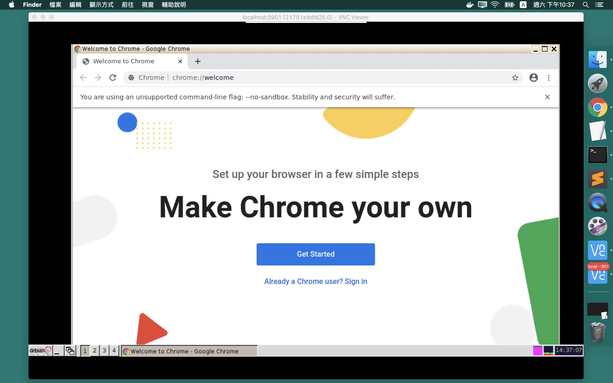
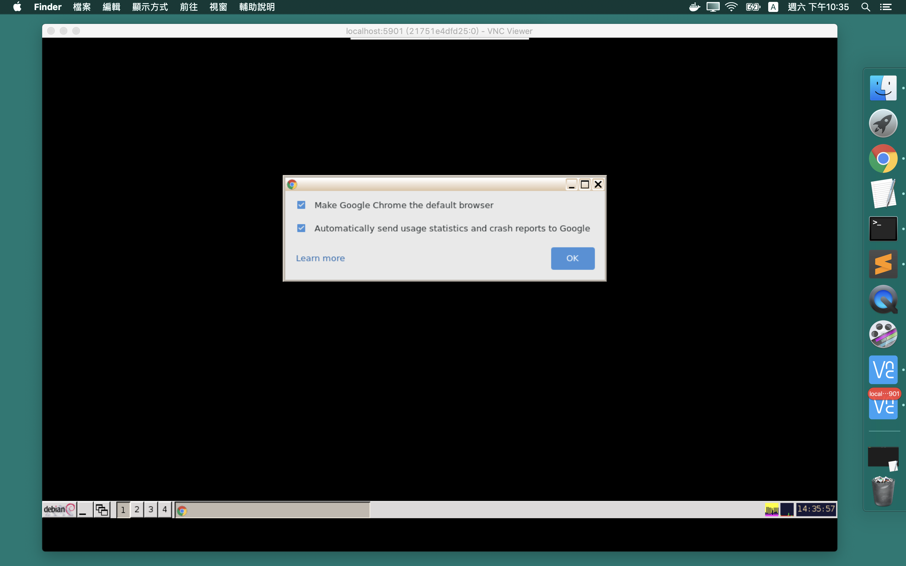

<h1 align="center">google-chrome</h1>

<p align="center">Your Universal Google Chrome by Docker</p>

## Preview



## Installation & run

* Step 1. Install `docker` by following [Docker official installation guide](https://docs.docker.com/install/).
Docker is cross-platform so you can run **google-chrome** on Mac OSX / Linux / Windows.

* Step 2. Download the image, run
```
$ docker pull weichuntsai/xserver:1.0
$ docker pull weichuntsai/google-chrome:1.0
```

* Step 3. Install a VNC viewer. I recommend [RealVNC](https://www.realvnc.com/en/connect/download/viewer/).

* Step 4. Initialize the **xserver** container, the command is as follows:
```
$ docker run --name mydisplay -e VNC_PASSWORD=1234 -p 5901:5900 weichuntsai/xserver:1.0
```
For other scenarios of this step, please refer to [xserver README.md](https://github.com/weichuntsai0217/xserver/blob/master/README.md)

* Step 5. Initialize the **google-chrome** container with link to **xserver** container (assume you want to name the google-chrome container as `chrome`), please run
```
$ docker run --name chrome -dt --link mydisplay:xserver --volumes-from mydisplay weichuntsai/google-chrome:1.0
```

* Step 6. Setup authentication cookie in the container `chrome` and run the command `google-chrome`
```
$ docker exec -it chrome bash
$ chmod 755 /setup-xclient.sh; /setup-xclient.sh xserver; source ${HOME}/.bashrc
$ google-chrome --no-sandbox
```

* Step 7. Open your VNC viewer in the host computer (assume you initialize **xserver** like Step 4),
connect to `localhost:5901` and type in the password `1234`,
then you can see your google-chrome console window inside the VNC viewer window like the following figure:

